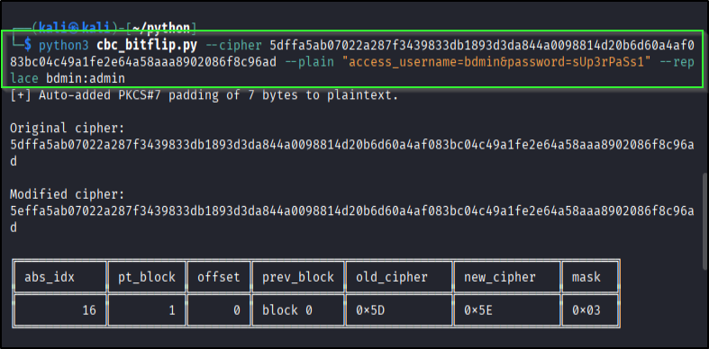

# 📝 Writeup – Flip (TryHackMe)

---

## PORT 1337 – The Fun Begins  
```bash
nc <MACHINE_IP> 1337
````

So I poked port 1337 (cause of course 😏) and… nothing fancy on the surface.
But then I peeked at the source code and spotted gold:

   
   
   

Basically: if `check == 1` we get the flag.
So to hit that, the decrypted input needs to contain:

```
admin&password=sUp3rPaSs1
```

Problem? We **can’t just type it in**.

---

## 💥 Enter AES CBC Bit Flipping

Here’s the vibe: if you tweak a byte in the cipher, it flips the corresponding byte in the **previous block** after decryption.

* Each block = 16 bytes (128 bits)
* Wanna target block 0? Then you gotta mess with the **IV** instead


---

### 🔐 Quick Crypto Recap

**Encryption (block i)**

$$
C_i = E_k(P_i \oplus C_{i-1})
$$

First block uses IV:

$$
C_0 = E_k(P_0 \oplus IV)
$$

**Decryption (block i)**

$$
P_i = D_k(C_i) \oplus C_{i-1}
$$

First block:

$$
P_0 = D_k(C_0) \oplus IV
$$

Where:

* `P_i` = plaintext block i
* `C_i` = ciphertext block i
* `IV` = initialization vector
* `E_k` = AES encryption
* `D_k` = AES decryption

---

### 🛠️ How I Did It

Step 1: Pick something **super close** to the real string but off by just **one byte**.
Step 2: Flip the cipher byte at the right spot.
Step 3: Watch magic happen — the decrypted block turns into what we need.

Basically, it’s like sending a slightly broken cookie and then secretly switching one chocolate chip — boom, instant perfection 🍪.



---

### 🎉 Flag Time

And just like that, we got the goodies:   


---

### 📚 Math / Explanation

Want the math nerd version? Check here: [CBC\_BitFlip](link)
But TBH, the fun part is flipping the bits like a sneaky hacker 😎

---

